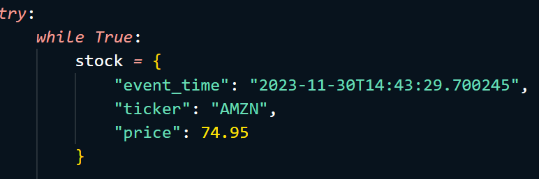
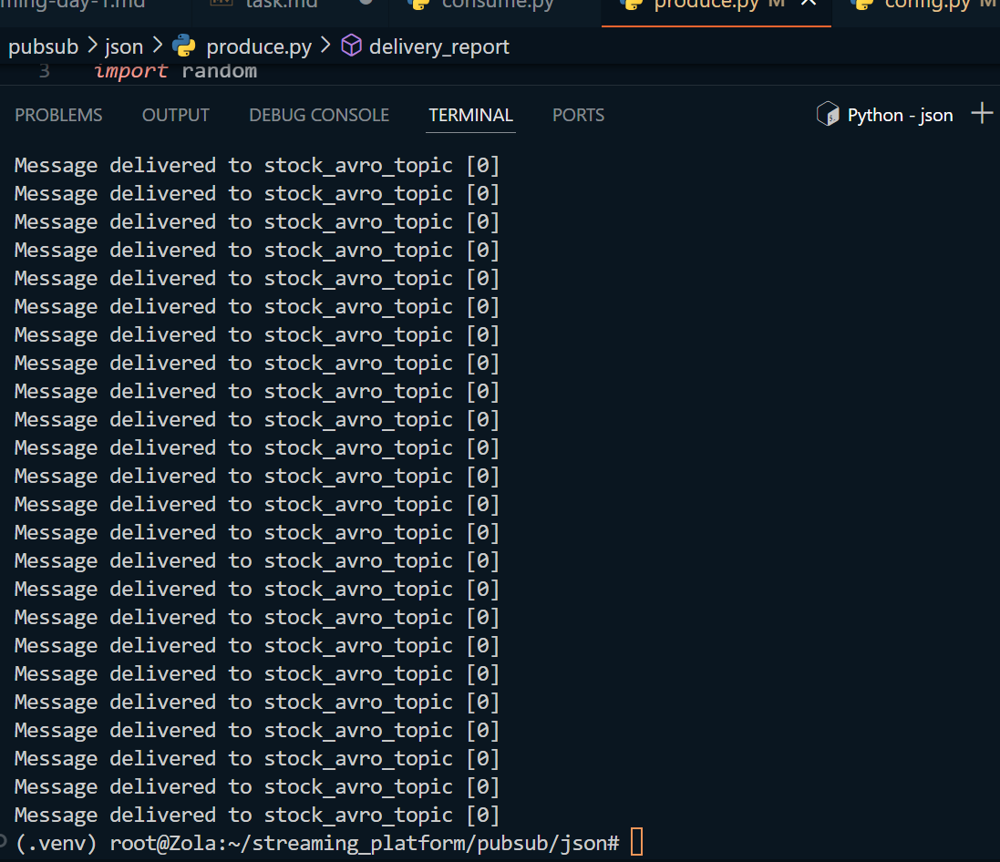

### TASK 
Create a new topic named stock_avro_topic, then publish the stock streaming data with avro schema to the newly created topic#### 1). Buat topik terbaru dengan nama 'stock_avro_topic'

#### 2). ganti topik di file 'config.py menjadi stock_avro_topic

#### 3). ubah isi di file produce.py 

#### 4). jalankan file produce.py 

#### 5). Messages sudah masuk dan bisa di cek melalui UI Redpandas 

